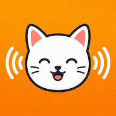

# NFCcat



Point one phone at another, press a button, the other phone goes *meow*.

Two Android phones, one NFC tap, one cat noise. No pairing, no network, no accounts. The
receiving phone does not even need the app open.

## How it works

Android Beam, the old phone-to-phone NFC push, was deprecated in Android 10 and removed in
Android 14. The modern way to get two phones talking over NFC is **Host Card Emulation (HCE)**,
where one phone pretends to be a contactless smart card:

- **The cat phone** registers a `HostApduService` under a custom AID (Application ID). To the
  outside world it looks like a smart card sitting in the field.
- **The pointer phone** turns on **reader mode**. When you press the button it sends a SELECT
  APDU naming that AID.
- Android on the cat phone routes that SELECT to the service, which plays the sound and answers
  `9000` (`SW_OK`).

A single phone cannot be reader and card at the same time, so both roles live in one APK and the
role is decided by what you do: whoever has the app in the foreground and presses the button is
the pointer, the other phone is the cat.

```
  Pointer phone                              Cat phone
  (app in foreground)                        (app closed)
        |                                        |
        |  press Meow -> reader mode armed       |
        |                                        |
        |  ==== tap, RF field ================>  |
        |                                        |
        |  SELECT 00A4040007 F0010203040506 00 ->|  Android routes by AID,
        |                                        |  binds MeowHceService
        |                                        |
        |  <-------------------------- 90 00 ----|  service returns SW_OK
        |                                        |  and plays meow.wav
```

## Layout

| File | What it does |
|---|---|
| `MainActivity.kt` | The pointer. Reader mode, the arm-then-tap button, NFC availability UI. |
| `MeowHceService.kt` | The cat. `HostApduService` bound by Android when the AID is selected. |
| `MeowPlayer.kt` | Process-scoped audio. Raw PCM straight to `AudioTrack`, no decoder. |
| `res/xml/apduservice.xml` | Declares the AID group Android routes on. |
| `res/raw/meow.wav` | The meow. 16-bit stereo PCM, 44.1kHz. |

The AID is `F0010203040506`. Proprietary AIDs should start with `F` so they cannot collide with a
real registered one, and must be 5 to 16 bytes. Category is `other`, not `payment`, so the app
does not have to be the default payment app.

## Using it

**Cat phone** (receives, meows)

- Install the APK. That is all.
- Do **not** open the app. Android launches the service on demand, which is the genuinely nice
  part of this design.
- NFC on, screen on, unlocked.

**Pointer phone** (sends)

- Open the app and keep it in the foreground. Reader mode only runs while the activity is
  resumed.
- Press **Meow**, the status changes to "Armed. Tap phones back to back".
- Bring the phones together, back to back.

Status then reads "Meow sent" or "No cat found". Arming is one shot, press again for each meow.

Do not open the app on both phones. Two phones in reader mode are both driving the field and
neither is presenting as a card, so nothing gets selected. One reader, one card, always.

Antenna alignment is the fiddly part, not the code. The coils are small and sit in different
places on different models, often upper-middle of the back. Slide the phones around slowly until
it catches. Thick cases can kill it outright.

## Building

```sh
./gradlew assembleDebug
adb install -r app/build/outputs/apk/debug/app-debug.apk
```

Requires a JDK 17+ and an Android SDK. `local.properties` points at the SDK and is not committed:

```properties
sdk.dir=/path/to/android-sdk
```

Emulators cannot do this. You need two real phones with NFC.

## The interesting bug

The first working version had perfect NFC and complete silence. The tap succeeded every time,
the reader logged `9000` coming back in 36ms, and no cat ever meowed.

`adb logcat` on the cat phone gave the whole story in eight lines:

```
15:01:12.963  D/MeowHce  onCreate: service starting
15:01:12.968  D/MeowHce  onCreate: load() returned sampleId=1
15:01:12.980  D/MeowHce  processCommandApdu: apdu=00A4040007F001020304050600 loaded=false
15:01:12.980  D/MeowHce  processCommandApdu: sample not ready, queued
15:01:12.993  D/HostEmulationManager  Unbinding from service
15:01:12.994  D/MeowHce  onDeactivated: reason=0
15:01:12.996  D/MeowHce  onDestroy: releasing SoundPool
```

**The service lives for 33 milliseconds.** Android binds it when the field arrives and destroys
it the moment the field drops. Note what is missing: `onLoadComplete` never fires.

`SoundPool.load()` is asynchronous. The SELECT arrived 12ms after the load started, so the sample
was not ready. Queuing the play until load completed did not help either, because `onDestroy`
called `soundPool.release()` 16ms later and threw the pending decode away. No async decoder can
win that race. `MediaPlayer` loses it the same way.

The fix is to take the decoder out of the picture and stop tying audio to the service lifetime:

- `meow.wav` is already uncompressed PCM, so `MeowPlayer` parses the RIFF header itself and hands
  the samples straight to `AudioTrack` in `MODE_STATIC`. Playback starts synchronously.
- `MeowPlayer` is an `object`, so the samples are process-scoped and survive the service being
  destroyed. The second tap reuses them.
- `onDestroy` no longer stops playback. The service dying is normal, the meow has to outlive it.

## Gotchas

- **Both phones need NFC on**, and the cat phone needs its screen on. Depending on the
  "Secure NFC" or "Require device unlock for NFC" setting it may also need to be unlocked, even
  though the service declares `requireDeviceUnlock="false"`.
- **The meow plays on `USAGE_MEDIA`**, so it follows the media volume slider, not the ringer.
  Silent mode does not mute it but a media volume of zero does.
- **Reader mode only works while the activity is in the foreground.**
- `uses-feature android:name="android.hardware.nfc.hce"` is declared `required="false"` on
  purpose. With `true` a phone without NFC could not install the app at all, so it could never
  show the "this phone has no NFC" message.
- Some chipsets are fussy about reading another phone's HCE. If one direction refuses to work,
  swap which phone plays which role.

## Debugging

Everything the cat side does is logged under the tag `MeowHce`:

```sh
adb logcat -s MeowHce:D HostEmulationManager:D
```

To confirm the AID is actually registered and routed on a phone:

```sh
adb shell dumpsys nfc | grep -A3 F0010203040506
```

To watch the raw APDUs on the reader side, `NxpNciX` is what goes out and `NxpNciR` what comes
back. A successful meow looks like this:

```
NxpNciX  len = 16 > 00000D00A4040007F001020304050600   SELECT our AID
NxpNciR  len =  5 > 0000029000                          90 00
```

If you see `6A82` instead of `9000`, the cat phone does not have the app installed or the AID is
not registered there.

## Alternatives

For the same "press a button, the other phone reacts" effect with far less fiddling, Google's
**Nearby Connections API** over Bluetooth or Wi-Fi Direct gives you range, no alignment problems,
and a persistent connection. NFC is the more charming version though. The tap is the whole point.
